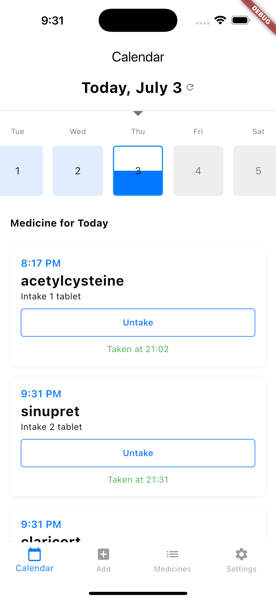
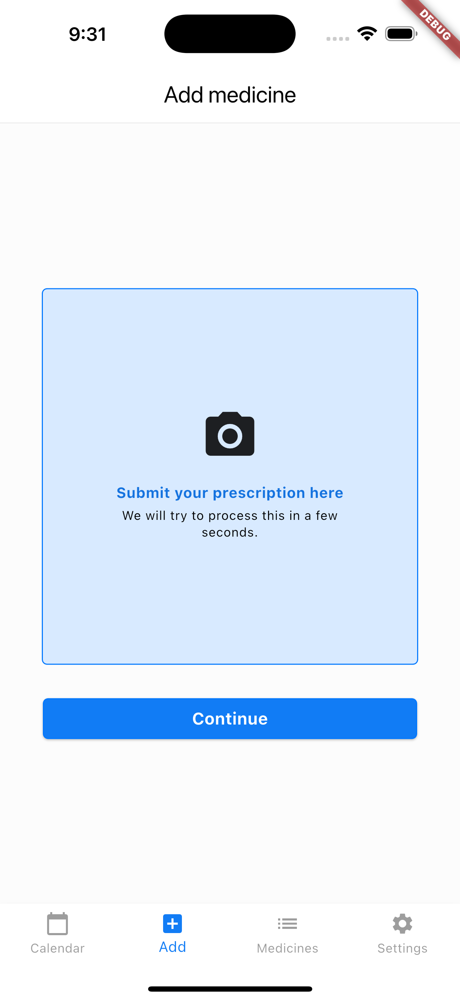
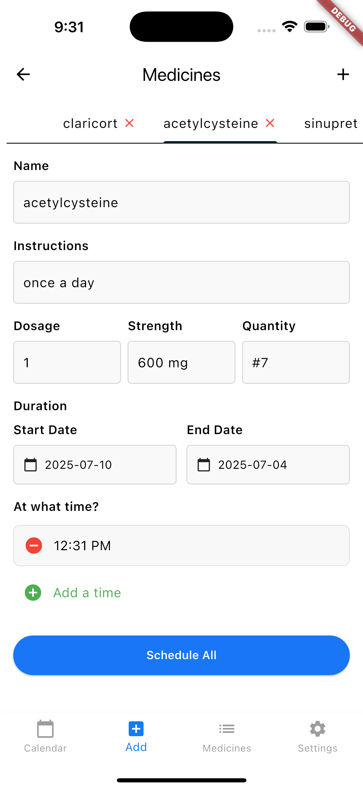
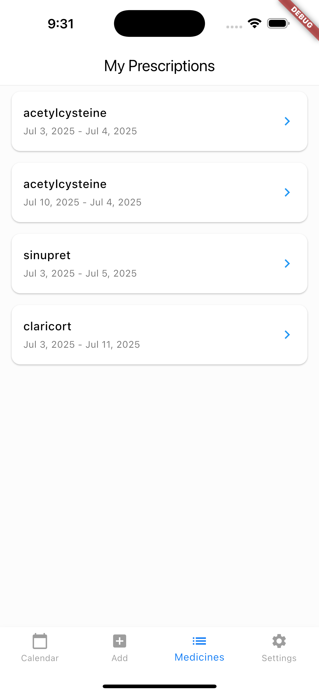
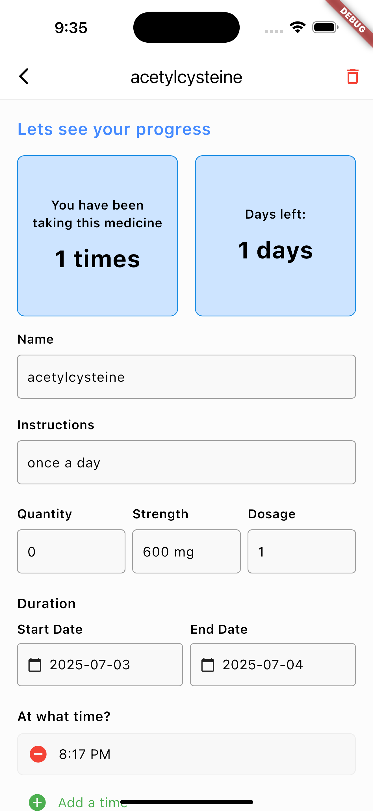

# 💊 SchedRx - Prescription Reader App


---

## 📖 Overview

**SchedRx** is an iOS app designed to simplify prescription management through AI-powered automation. It reads printed prescriptions, extracts essential medical information, and generates medication schedules and reminders—**customized for the Philippine context**.

- 🔎 Extracts medication, dosage, frequency, and duration using **Med7**
- 🇵🇭 Built on **localized datasets** (Philstats)
- 🧠 Powered by **Python backend** + **Flutter frontend**
- 🔥 Integrates with **Firebase** to track intake and schedule adherence
- 🏥 Offers a clean, hospital-inspired UI for a distraction-free experience

---

## ✨ Key Features

| Feature               | Description                                                                 |
|----------------------|-----------------------------------------------------------------------------|
| 🖼️ **Image Parsing**    | Extract text from prescription images using OCR                            |
| 🤖 **Med7 Integration** | AI-powered medicine information extraction via Named Entity Recognition     |
| 🇵🇭 **Localized Dataset**| Philippine-specific medicine and supplement names (from Philstats)          |
| 🧾 **Custom Parsing**    | Merges frequency + duration, regex for quantity parsing (`#10 tablets`)     |
| 🔥 **Firebase Sync**     | Real-time logging of medication intake and dosage adherence                |
| 🏥 **Clean UI**          | Minimalist, accessible UI inspired by medical/hospital systems             |

---

## 🖼️ Screenshots

|                             |                             |                              |
|:---------------------------:|:---------------------------:|:----------------------------:|
|  <br> *Home* |  <br> *Add Medicine* |  <br> *Schedule* |
|  <br> *Medicine List* |  <br> *Details* | |

---

## 🛠️ Installation

### 🔧 Backend Setup
```bash
cd backend
pip install -r requirements.txt
uvicorn main:app --reload
```

### 📱 Frontend Setup (Flutter)
```bash
cd frontend
flutter pub get
flutter run
```

> **Note:** Ensure Firebase is properly configured for your Flutter project.

---

## 💡 Why I Built This

As someone who regularly takes prescriptions, I found it repetitive and time-consuming to manually track medication schedules. This inspired me to build SchedRx—an AI-powered tool that automates prescription parsing and generates reminders.

I focused on adapting this app for Filipino users, utilizing Philippine-specific datasets and adding custom logic to handle nuances not covered by existing medical NLP tools.

---

## 🧪 Enhancements Made to Med7

To ensure Med7 worked in real-world Philippine settings, I introduced several key additions:

- 🔍 **Localization**: Adapted Med7 using Philstats datasets (medicines + supplements)
- 🧾 **Field Merging**: Combined frequency and duration fields for user-friendly display
- 🆔 **Regex Enhancements**: Added quantity detection via # symbols (e.g., #10 tablets)
- 🔄 **Schedule Conversion**: Mapped Med7 output into structured schedule data
- 🗃️ **Firebase Logging**: Synced user intake data—track dosage frequency, timing, and duration

---

## 🧠 Lessons Learned

- 📸 Mastered the full OCR ➜ NER ➜ structured data pipeline
- 🤖 Learned how to fine-tune NLP models (Med7) for local medical contexts
- 🔤 Added regex parsing skills for flexible prescription formats
- 🎨 Designed a clean and intuitive UI with Flutter
- ☁️ Deepened understanding of Firebase integration for real-time updates

---

## 🚧 Challenges Faced

- 🧾 **Parsing Variability**: Doctors write prescriptions in highly inconsistent formats
- 🌍 **Model Adaptation**: Med7 was originally trained on UK medical data, so localization was critical
- 🔄 **Schedule Accuracy**: Merging frequency and duration without losing information
- 🔥 **Real-Time Syncing**: Avoiding Firebase performance bottlenecks for live medicine tracking

---

## 🛠️ Tech Stack

- **Frontend**: Flutter
- **Backend**: FastAPI (Python)
- **Database**: Firebase
- **AI/ML**: Med7 (Named Entity Recognition)
- **Dataset**: Philstats (Philippine medical data)

---

## 👥 Credits

### 🧠 Med7
Named Entity Recognition model used for extracting medical entities from text
🔗 [Med7 GitHub Repository](https://github.com/kamalkraj/med7)

### 📊 Philstats
Provided Philippine-specific datasets for medicines and supplements

---


## 📧 Contact

If you have any questions or suggestions, feel free to reach out!
